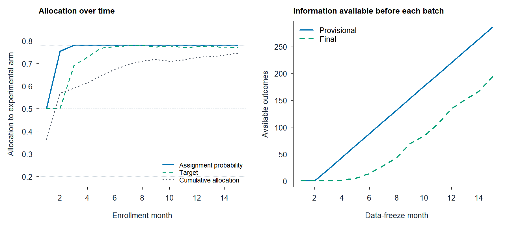

# ReRAR

**Revision-aware Response-Adaptive Randomization** · Version **1.1**

ReRAR uses provisional outcomes, returned final outcomes and paired validation
data to update allocation in a two-arm trial. Final treatment inference uses
randomized participants' final outcomes and stored assignment probabilities.

[Installation](#installation) · [Worked example](#worked-example) ·
[Visualization](#visualization) · [Functions](#functions)

## Installation

Install version 1.1 from GitHub:

```r
install.packages("remotes")
remotes::install_github("haohaostats/ReRAR@v1.1")
library(ReRAR)
```

## Worked example

One built-in object contains the complete workflow:

```r
data(exam_example)
x <- exam_example
print(x$validation, row.names = FALSE)
```

```text
 arm se_success se_failure sp_success sp_failure
   0         36         19         48          8
   1        131         19         44         25
```

The validation component contains published EXAM paired-assessment counts.
The participant records are **synthetic**: 330 participants in 15 batches,
with an interim snapshot before batch 8.

| Component | Contents |
|---|---|
| `validation` | Published paired counts for control (0) and experimental (1) arms |
| `trial` | Visible interim history for 154 participants |
| `final` | Complete synthetic outcomes and stored assignment probabilities |
| `trajectory` | Fifteen allocation updates and outcome-availability counts |
| `metadata` | Source, seed, settings and data provenance |

### Update allocation

Use the example's prespecified bounds, 0.20 and 0.78:

```r
update <- rerar_update(
  x$trial, x$validation,
  lower = 0.20, upper = 0.78
)
print(update)
```

```text
ReRAR allocation update
  next-batch probability: 0.7800
  target allocation:      0.7796
  evidence z:             3.194
```

### Randomize a batch

```r
next_batch <- rerar_randomize(6, update, seed = 42)
print(next_batch, row.names = FALSE)
```

```text
 A   pi
 0 0.78
 0 0.78
 1 0.78
 0 0.78
 1 0.78
 1 0.78
```

`A` is the realized assignment; `pi` is its stored experimental-arm probability.
This six-person demonstration is independent of the built-in complete trial.

### Analyze final outcomes

```r
fit <- with(
  x$final,
  rerar_analyze(A, Y, pi, working0, working1)
)
print(fit)
```

```text
ReRAR final analysis
  risk difference: 0.1485
  standard error:  0.0654
  p-value (greater): 0.01161
  95.0% CI: [0.0203, 0.2767]
```

Both working means were fixed at 0.5 before enrollment. With the default
analysis options, the p-value is one-sided (experimental superiority), while
the 95% Wald interval is two-sided. External validation counts do not enter
the final analysis.

## Visualization



For a compact plot directly in R:

```r
t <- x$trajectory
matplot(
  t$month,
  cbind(t$probability, t$target, t$cumulative_allocation),
  type = "l", lty = c(1, 2, 3), lwd = 2,
  col = c("#0072B2", "#009E73", "#4B5563"),
  xlab = "Enrollment month", ylab = "Experimental-arm allocation",
  ylim = c(0.18, 0.86), bty = "l"
)
legend(
  "bottomright", c("Assignment probability", "Target", "Cumulative allocation"),
  col = c("#0072B2", "#009E73", "#4B5563"),
  lty = c(1, 2, 3), lwd = 2, bty = "n"
)
```

## Functions

| Function | Purpose |
|---|---|
| `rerar_validation()` | Construct treatment-specific validation counts |
| `rerar_history()` | Encode currently visible binary outcomes |
| `rerar_update()` | Compute evidence, target and assignment probability |
| `rerar_randomize()` | Draw a batch and store its probabilities |
| `rerar_analyze()` | Perform the final contrast-stabilized AIPW analysis |

Use `?exam_example` for every field and setting, or `?rerar_update` for allocation
options. Outcomes are coded as 1 for success and 0 for failure; unavailable
outcomes are `NA`.

## Data source

The published validation counts come from Table 13 of the
[FDA statistical review for cabozantinib](https://www.accessdata.fda.gov/drugsatfda_docs/nda/2012/203756Orig1s000StatR.pdf).
All participant-level observations and return times in this package are simulated.
